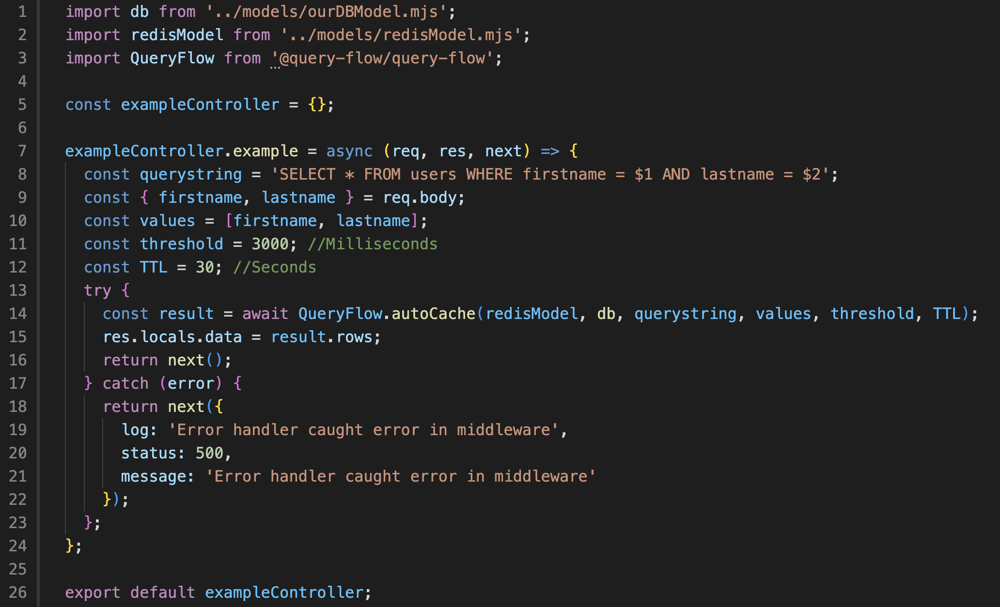

# query-flow

<!-- PROJECT LOGO -->
<br />
<div align="center">
  <a href="www.query-flow.com">
    
  </a>

<h3 align="center">query-flow</h3>

  <p align="center">
    Lightweight middleware that automatically caches results of slow SQL queries.
    <br />
    <!--Do we need explore the docs? The README is basically the documentation.-->
    <a href="https://github.com/github_username/repo_name"><strong>Explore the docs »</strong></a>
    <br />
    <br />
    <!--We can add a gif or video of a demo in the README -->
    <a href="https://github.com/github_username/repo_name">View Demo</a>
    ·
    <a href="https://github.com/oslabs-beta/query-flow-npm/issues">Report Bug</a>
    ·
    <a href="https://github.com/oslabs-beta/query-flow-npm/issues">Request Feature</a>
  </p>
</div>

<!-- TABLE OF CONTENTS -->
<details>
  <summary>Table of Contents</summary>
  <ol>
    <li>
      <a href="#about-the-project">About The Project</a>
    </li>
    <li>
      <a href="#getting-started">Getting Started</a>
      <ul>
        <li><a href="#prerequisites">Prerequisites</a></li>
        <li><a href="#installation">Installation</a></li>
      </ul>
    </li>
    <li><a href="#usage">Usage</a></li>
    <li><a href="#roadmap">Roadmap</a></li>
    <li><a href="#contributing">Contributing</a></li>
    <li><a href="#license">License</a></li>
    <li><a href="#contact">Contact</a></li>
    <li><a href="#acknowledgments">Acknowledgments</a></li>
  </ol>
</details>

<!-- ABOUT THE PROJECT -->

## About The Project

  <a href="www.query-flow.com">
    
  </a>

Before the development of an NPM package to automatically cache slow queries to relational databases, a web application was made for developers to analyze and visualize the performance of SQL queries. With these insights into the performance of an application's backend queries, developers can implement data-based thresholds with the query-flow npm package, such that queries slower than the set threshold will be stored in a cache database. This increases the performance of queries by reducing queries times up to 94%.

Here's a blank template to get started: To avoid retyping too much info. Do a search and replace with your text editor for the following: `github_username`, `repo_name`, `twitter_handle`, `linkedin_username`, `email_client`, `email`, `project_title`, `project_description`

_For more examples, please refer to [www.query-flow.com](www.query-flow.com)_

<p align="right">(<a href="#readme-top">back to top</a>)</p>

<!-- GETTING STARTED -->

## Getting Started

### Prerequisites

This package assumes that a Redis instance has already been set up alongside a primary relational database.

### Installation

To get started:

```sh
npm install @query-flow/query-flow
```

<!-- USAGE EXAMPLES -->

## Usage

### Example Use Cases

**Session Storage**

With an automatic cache backend architecture, a session store could be used to cache user session data. This improves the speed and efficiency of accessing session data, since the data is kept in a fast-access cache instead of slower primary storage, like a relational database. The cache can store frequently accessed session data, which reduces the load on the database and improves response times for the user.

**Machine Learning**

Machine learning models can often be quite large and take time to load. If an application needs to make frequent predictions in real time, it may be too slow to load the model from disk each time a prediction is needed. Redis can be used to cache the models in memory for fast access. This significantly reduces the prediction latency and improves the overall speed of the ML application.

**Frequently Fetched Data or Costly Queries**

Storing fetch requests result sets in memory decreases the processing time for web applications that need to return data from complex queries. Furthermore, data that is frequently used need not be retrieved from a slow primary relational database, it can be kept in memory for quick retrieval as it is often requested by the client.

  <a>
    
  </a>

<p align="right">(<a href="#readme-top">back to top</a>)</p>

## Parameters

- [ ] redisModel: Redis client to be set as 'redisModel' or imported as 'redisModel'.
- [ ] db: Database client to be set as 'db' or imported as 'db'.
- [ ] querystring: User to pass in variable with the value of the relevant query string.
- [ ] values: User to pass in an array of values to be used to query the primary database
- [ ] threshold: User to set threshold in milliseconds
- [ ] TTL: User to set TTL in SECONDS

We recommend using the volatile-ttl eviction policy with this package, however, this is a recommendation only.

See the [open issues](https://github.com/github_username/repo_name/issues) for a full list of proposed features (and known issues).

<p align="right">(<a href="#readme-top">back to top</a>)</p>

<!-- CONTRIBUTING -->

## Contributing

Contributions are what make the open source community such an amazing place to learn, inspire, and create. Any contributions you make are **greatly appreciated**.

If you have a suggestion that would make this better, please fork the repo and create a pull request. You can also simply open an issue with the tag "enhancement".
Don't forget to give the project a star! Thanks again!

1. Fork the Project
2. Create your Feature Branch (`git checkout -b feature/AmazingFeature`)
3. Commit your Changes (`git commit -m 'Add some AmazingFeature'`)
4. Push to the Branch (`git push origin feature/AmazingFeature`)
5. Open a Pull Request

<p align="right">(<a href="#readme-top">back to top</a>)</p>

<!-- LICENSE -->

## License

Distributed under the MIT License. See `LICENSE.txt` for more information.

<p align="right">(<a href="#readme-top">back to top</a>)</p>

<!-- CONTACT -->

## Contact

QueryFlow - [@twitter_handle](https://twitter.com/twitter_handle) - queryflow58@gmail.com

Web Application - Query Performance Visualizer and Analyzer: [https://www.query-flow.com/](https://www.query-flow.com/)

<p align="right">(<a href="#readme-top">back to top</a>)</p>

<!-- ACKNOWLEDGMENTS -->

## Team

- []() Vivek Patel
- []() Niko Amescua
- []() Ryan Campbell
- []() Philip Brown
- []() George Greer

<p align="right">(<a href="#readme-top">back to top</a>)</p>

<!-- MARKDOWN LINKS & IMAGES -->
<!-- https://www.markdownguide.org/basic-syntax/#reference-style-links -->

[contributors-shield]: https://img.shields.io/github/contributors/github_username/repo_name.svg?style=for-the-badge
[contributors-url]: https://github.com/github_username/repo_name/graphs/contributors
[forks-shield]: https://img.shields.io/github/forks/github_username/repo_name.svg?style=for-the-badge
[forks-url]: https://github.com/github_username/repo_name/network/members
[stars-shield]: https://img.shields.io/github/stars/github_username/repo_name.svg?style=for-the-badge
[stars-url]: https://github.com/github_username/repo_name/stargazers
[issues-shield]: https://img.shields.io/github/issues/github_username/repo_name.svg?style=for-the-badge
[issues-url]: https://github.com/github_username/repo_name/issues
[license-shield]: https://img.shields.io/github/license/github_username/repo_name.svg?style=for-the-badge
[license-url]: https://github.com/github_username/repo_name/blob/master/LICENSE.txt
[linkedin-shield]: https://img.shields.io/badge/-LinkedIn-black.svg?style=for-the-badge&logo=linkedin&colorB=555
[linkedin-url]: https://linkedin.com/in/linkedin_username
[product-screenshot]: images/screenshot.png
[Next.js]: https://img.shields.io/badge/next.js-000000?style=for-the-badge&logo=nextdotjs&logoColor=white
[Next-url]: https://nextjs.org/
[React.js]: https://img.shields.io/badge/React-20232A?style=for-the-badge&logo=react&logoColor=61DAFB
[React-url]: https://reactjs.org/
[Vue.js]: https://img.shields.io/badge/Vue.js-35495E?style=for-the-badge&logo=vuedotjs&logoColor=4FC08D
[Vue-url]: https://vuejs.org/
[Angular.io]: https://img.shields.io/badge/Angular-DD0031?style=for-the-badge&logo=angular&logoColor=white
[Angular-url]: https://angular.io/
[Svelte.dev]: https://img.shields.io/badge/Svelte-4A4A55?style=for-the-badge&logo=svelte&logoColor=FF3E00
[Svelte-url]: https://svelte.dev/
[Laravel.com]: https://img.shields.io/badge/Laravel-FF2D20?style=for-the-badge&logo=laravel&logoColor=white
[Laravel-url]: https://laravel.com
[Bootstrap.com]: https://img.shields.io/badge/Bootstrap-563D7C?style=for-the-badge&logo=bootstrap&logoColor=white
[Bootstrap-url]: https://getbootstrap.com
[JQuery.com]: https://img.shields.io/badge/jQuery-0769AD?style=for-the-badge&logo=jquery&logoColor=white
[JQuery-url]: https://jquery.com
